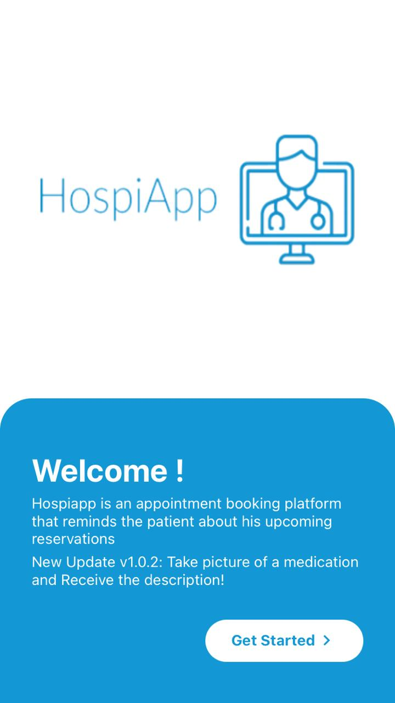
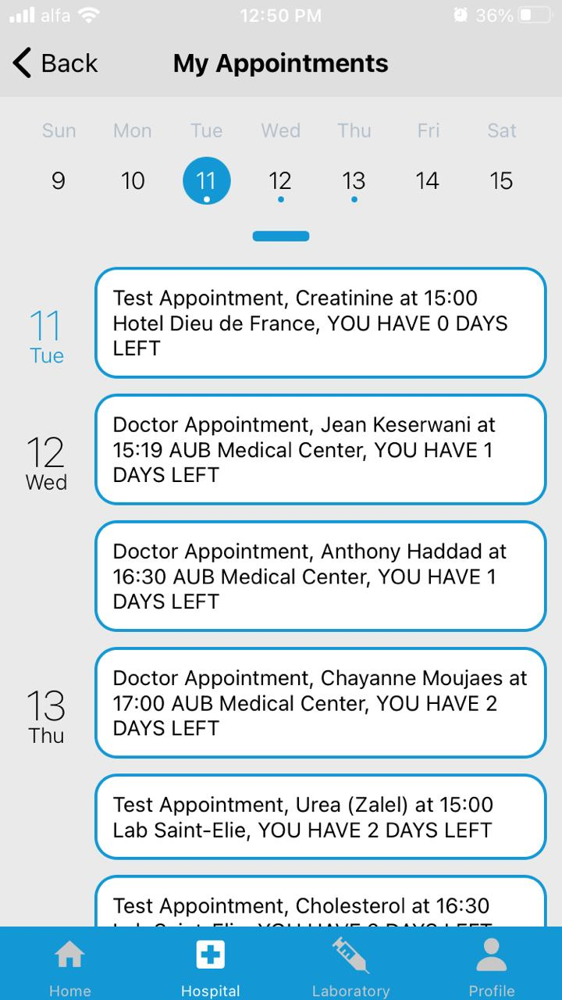
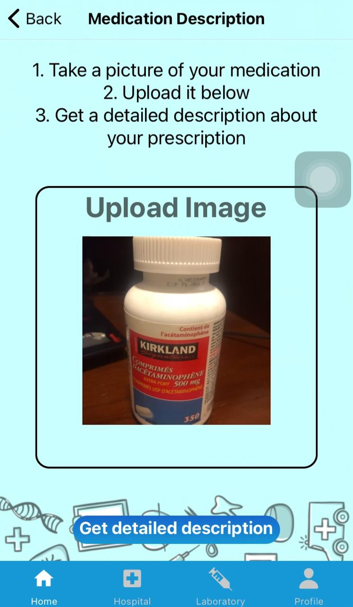
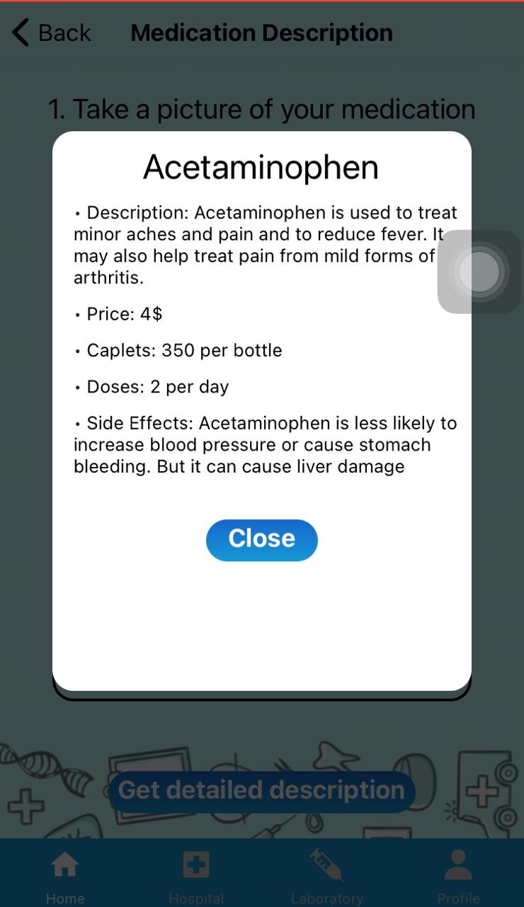

# HospiApp

Hospiapp is a checkup and labtest appointment booking platform. Users can sign up and login using their credentials and reserve a date for a consultation with a doctor based on the doctor's availibility day and hour, as well as schedule a lab test at specific location, date and time.

The frontend is implemented using React-Native framework.

The backend is implemented using Python-Flask, you can check the reposatory using the link below, and integrated with MongoDB-Atlas to store the data:
https://github.com/Michelk-byte/MobileDev

  
  

  
  

# Special Feature

Patients can take a picture of a medication and will receive a glimpse about the description. However, this project is just a proof of concept, we would be glad if some young talented programmers contribute to it. 

  
  

